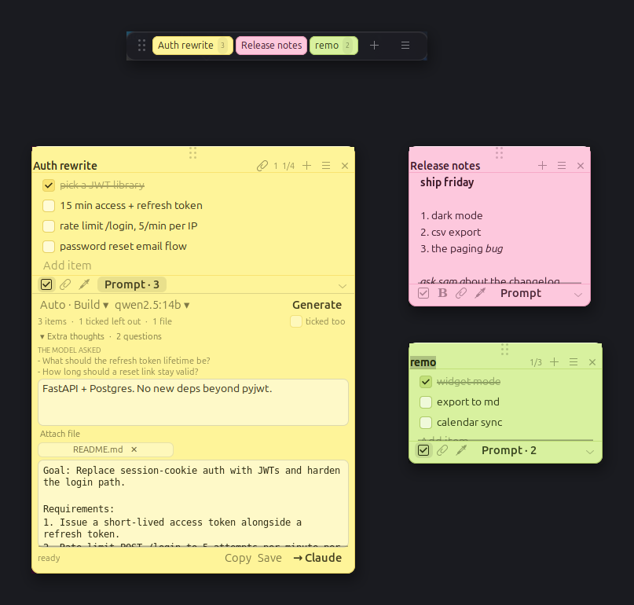

# Stickies

**Post-it notes for your Linux desktop that turn into Claude prompts.**

Stick a note on your screen, keep a running checklist for a project, tick things
off as they land — then hit ✨ and a panel drops out of the bottom of the note.
Your local Ollama model reads what's *still unticked* and rewrites it into a
structured prompt for Claude Code, which you can copy or open straight into a
terminal. It never wastes the prompt describing your project back to Claude —
Claude can read the repo. Attach your README and it writes against your real
files and commands;
if it still needs something you didn't say, it asks — in a dropdown, not in the
prompt.

Nothing leaves your machine. Notes are a JSON file in `~/.local/share/stickies/`,
and the rewriting runs on your own Ollama server.



---

## Why

A note app that only stores text makes you do the translation work twice: once
when you jot the idea down, again when you turn it into something an agent can
act on. Stickies keeps the note as the source of truth. The checklist *is* the
scope — tick an item and it drops out of the next prompt, add one and it's in.
The prompt is generated, not maintained.

## Install

```bash
git clone https://github.com/dsneed123/stickies.git
cd stickies
./install.sh
stickies
```

`install.sh` puts a `stickies` launcher on your PATH and an entry in the app
grid, and offers to start it at login. Nothing is copied — the launcher points
back at the clone, so `git pull` updates it.

Requirements: `python3-gi` and `gir1.2-gtk-3.0` (preinstalled on Ubuntu GNOME),
plus [Ollama](https://ollama.com) running locally with at least one model pulled.
No third-party Python packages — GTK 3 via PyGObject, `urllib` for Ollama.

```bash
stickies          # start, or raise the notes if it's already running
stickies --new    # start and add a fresh note
stickies -f       # run in the foreground, logging to the terminal
```

It detaches by default, so your shell comes straight back. A second `stickies`
raises the existing instance instead of starting a duplicate.

## The notes

Each note is its own borderless, always-on-top window.

| | |
|---|---|
| **Move** | drag the washi tape across the top, drag the title, or middle-click-drag anywhere |
| **Resize** | drag the ⌄ corner at the bottom right |
| **Roll up** | double-click the title bar |
| **Menu** | ≡, or right-click anywhere on the note |
| ☑ | switch between plain text and checklist |
| **B** | formatting (text mode only) |
| clip | attach a file as context — click again to see or detach what's on |
| calendar | attach dates or events to the note (Ctrl+E); the next one shows in the header |
| dropper | note colour — seven shades in whichever theme you're using |
| ✕ | hides the note; it stays in the deck until you delete it |
| **Drop a file on it** | attaches that file as context for the note's prompts |

*Keep on top* lives in the ≡ menu rather than the footer — a pin icon next to a
paperclip reads as "pin a file", which is not what it does.

**Checklists:** Enter starts the next item · Backspace on an empty item deletes it
· Alt+↑/↓ reorders · Ctrl+Enter ticks. Items wrap, so long ones stay readable.

**Formatting** (plain-text notes): Ctrl+B bold · Ctrl+I italic · Ctrl+U underline
· Ctrl+Shift+X strikethrough · Ctrl+Shift+8 bullet list · Ctrl+Shift+7 numbered
list · Ctrl+Shift+Space clears it. Typing Enter at the end of `- thing` or
`3. thing` starts the next item and keeps the numbering going; Enter on an empty
one ends the list. Formatting is stored as offset spans next to the plain text,
so the file stays greppable and converts cleanly to markdown when it reaches the
model.

**Shortcuts:** `Ctrl+N` new · `Ctrl+Enter` prompt panel · `Ctrl+T` text/checklist
· `Ctrl+D` duplicate · `Ctrl+L` all notes · `Ctrl+W` hide · `Ctrl+,` settings ·
`Ctrl+Q` quit.

## The deck

A slim pill pinned to the top of your screen holds every note as a coloured tab,
with the count of open items on it. It stands in for a tray icon, which GNOME on
this setup has no indicator support for.

- **Click a tab** to bring that note down, click again to put it away
- **Drag a tab downwards** to pull the note out and drop it where you want it
- **Drag a note back up onto the deck** and hold it there for a moment — the deck
  lights up and the note goes back in
- **＋** for a new note, **≡** for the menu (themes, all notes, settings, quit)
- Right-click a tab for that note's own menu

Put-away notes keep everything — they're just off the desktop. Drag the deck by
its ⠿ handle to move it; it remembers where you left it. Hide it entirely from
its menu or in Settings.

## Themes

Six of them, switchable live from the deck's ≡ menu or Settings. Every note
repaints instantly and keeps its colour slot, so a yellow note stays the yellow
one in whichever theme.

| | |
|---|---|
| **Classic Post-it** | the real Post-it range — canary, limeade, blue sky |
| **Pastel** | milky and low-saturation |
| **Bubblegum** | candy pinks and purples |
| **Mint** | cool greens and teals |
| **Highlighter** | loud brights |
| **Night** | dark paper, light ink, for dark desktops |

Night isn't just inverted colours — the input fields, checkboxes and chips flip
with it, so nothing ends up as light text on a light field.

## The prompt panel

Hit **Prompt** and the note grows downward into a panel — no second window. The
button shows how many items are in scope, e.g. `Prompt · 3`.

**A ticked box means done, so it stays out of the prompt.** That's the whole
idea: keep one note per project, add to it as things come up, tick them off as
they ship, and every generation covers only what's still outstanding. The
*ticked too* toggle overrides it when you want the full list.

### It doesn't tell Claude what your project is

Claude Code has the repo open. A prompt that opens with *"This is a FastAPI
service backed by Postgres…"* spends your context explaining something it can
read in a second. So the prompt writer is told, bluntly, not to: no stack
summaries, no directory tours, no restating anything a file would answer.

Context survives only for what *isn't* in the repo — decisions already taken,
outside constraints, things tried and rejected. If there's none of that, the
section is dropped.

The difference is stark. The same note, before and after this rule: about a
thousand characters of which a third described the project, versus 302 characters
that are all instruction.

### Nine approaches, or let it choose

A debugging prompt and a refactoring prompt shouldn't be shaped the same way, so
each approach has its own structure:

| Approach | Shapes the prompt around |
|---|---|
| **Build it** | goal, numbered requirements, out of scope, acceptance criteria |
| **Plan first** | read before proposing, steps, trade-offs, risks — no code yet |
| **Track down a bug** | symptom, expected, repro, ruled out; prove the cause before fixing |
| **Refactor** | what must not change, small verifiable steps, how to check |
| **Review code** | what to review, priorities, what a finding must include |
| **Investigate** | a question, where to look, what the answer needs — changes nothing |
| **Write tests** | what to cover, awkward cases, existing conventions, done means |
| **Mechanical sweep** | the change, how to find every site, rules, verification |
| **Weigh the options** | the decision, options, criteria, one committed recommendation |

**Auto** is the default and usually the right answer: a quick classification call
picks the approach, then the real generation runs with it. The button shows what
it landed on — `Auto · Debug` — and you can override it any time. Spot-checked on
seven notes against qwen2.5:14b, it picked the intended approach seven times.

### Extra thoughts

One dropdown, closed until you want it. Inside is a free-text box for whatever
the note leaves out — constraints, decisions, anything not in the code. It's
saved with the note.

It's also where the model talks back. **Open questions never go inside the
prompt** — a prompt you paste into Claude has to stand on its own, not carry a
list of things nobody answered. Anything the model needs decided shows up as
`Extra thoughts · 2 questions`. Open it, read what it asked, type the answers
into the same box, hit Generate again. That's the whole loop.

### Attachments

Drop a README, spec or config onto a note — or use **Attach file** in the
dropdown — and it rides along with every prompt from that note. Attachments are
**re-read from disk on each run**, so editing your README updates the next prompt
without re-attaching it. A clip badge on the note shows how many are on; click a
chip to detach.

Files are sent as *background, explicitly not the task*, so the checklist stays
the scope. They're there so the model gets your real file names, commands and
conventions right and stops asking about what they already answer — never so it
can hand the contents back to you.

Text files only, capped at 16k characters each and 32k combined; anything longer
is truncated rather than dropped, and a missing or binary file shows as a warning
chip with the reason instead of failing the run.

### Then

The result streams in live and is editable in place. **Copy** and **→ Claude**
send the prompt alone — never the questions. **Save** keeps it as its own note,
and **→ Claude** opens a terminal running `claude` with the prompt already
passed in.

Models that emit `<think>` blocks are handled — the reasoning is stripped out of
the prompt rather than pasted into it.


## Settings

`Ctrl+,` or the ≡ menu: Ollama server and model, temperature, default note
colour, text size, a handwritten-font toggle, and which terminal **→ Claude**
should use.

The **prompt-writer instructions** box is the system prompt your local model
follows. The default forbids inventing details — anything the notes leave
undecided has to come back as a question rather than a guess, which is what stops
a 7B model quietly deciding your refresh tokens last 30 days. It also tells the
model to emit those questions *after* a `---OPEN QUESTIONS---` marker, which is
how they get kept out of the prompt. Edit it freely; *Restore default
instructions* brings it back. If you never touched it, upgrades replace it
automatically; if you did, yours is left alone.

## Where things live

```
~/.local/share/stickies/notes.json          notes + settings
~/.local/share/stickies/notes.backup.json   previous save
~/.local/share/stickies/stickies.log        launcher output
```

Saves are debounced and atomic, so a crash mid-keystroke can't shred the file.

## Layout

```
stickies/
  app.py              application controller, owns every window
  note_window.py      one note = one window: drag, resize, checklist, rich text
  prompt_panel.py     the ✨ drop-down: builds the request, streams the result
  ollama.py           streaming /api/chat client, stdlib only
  store.py            JSON persistence, default system prompt, prompt modes
  theme.py            the Post-it palette and stylesheet
  board.py            "All notes"
  deck.py             the pinned top-of-screen strip
  settings_window.py  settings
  util.py             small GTK helpers
```

## Notes on the look

Flat colour, no gradients anywhere — the paper is one tone, the header is
separated by a hairline rather than a wash, and depth comes only from a layered
shadow. Corners are 10px, buttons 6px, checkboxes precise rounded squares, and
the icons are monochrome symbolic glyphs rather than emoji, which read as cheap
at this size. Text is set with real line spacing, and the panel's section labels
are small letterspaced caps rather than another boxed-in field.

The stylesheet overrides the system GTK theme per-colour on every text-bearing
node. Without that, a dark desktop theme paints light text onto light paper —
which is exactly what happened the first time this ran.

## Licence

MIT
